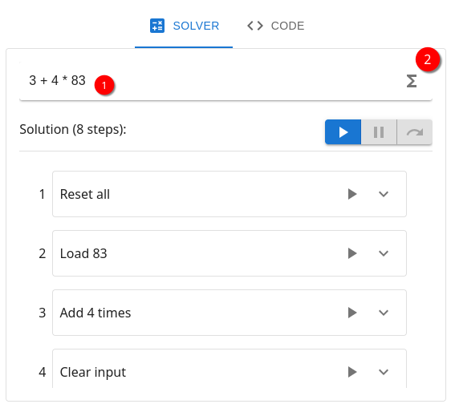
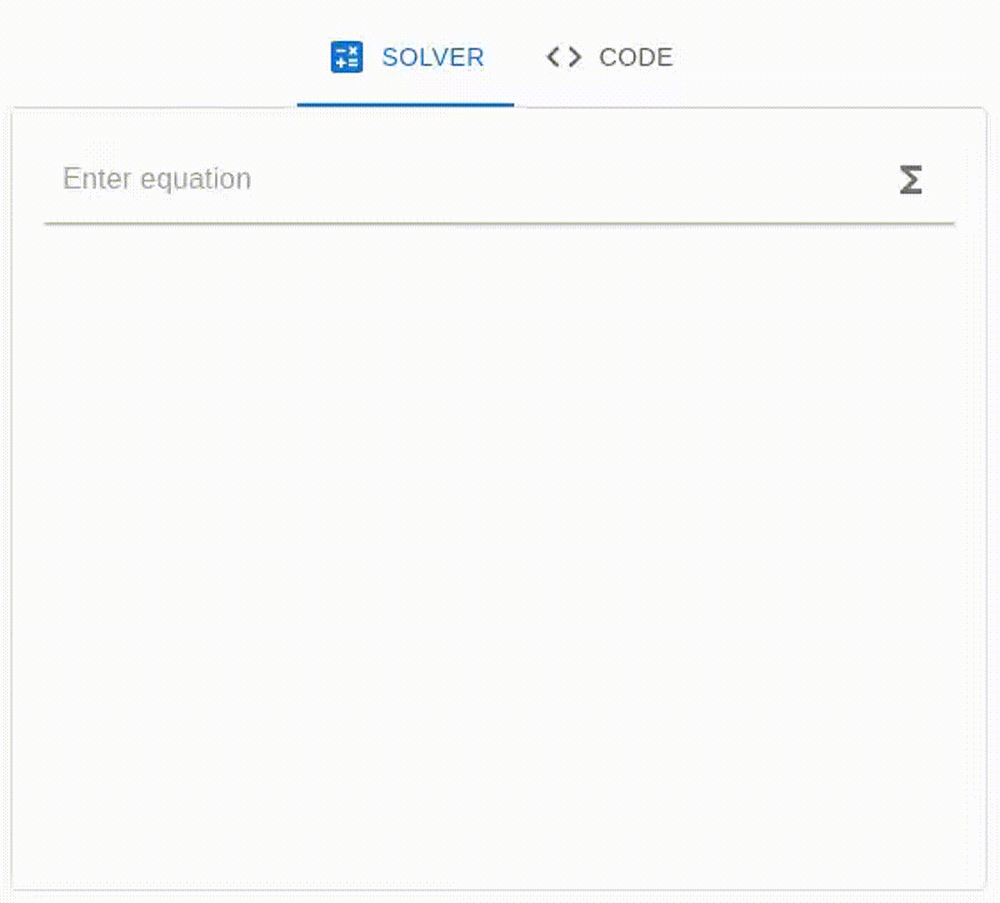

# Solving calculations

The simulation is capable of generating the steps required for solving a given
computation. This chapter gives an introduction to working with the editor
for the solver and explains the behavior and capabilities.

## Generate steps

On the right-hand side of the page under the "SOLVER" tab a
calculation can be entered in a text field (1). Valid calculations use the
most commonly used "infix" notation which is the natural way we write equations.
This means any operation is sandwiched in between its operands.
The solver supports these three arithmetic operations: addition, subtraction
and multiplication. Additionally, parenthesis are allowed to enforce the
evaluation of certain operations before others. Operator precedence is accounted
for, in other words multiplication binds stronger than addition and subtraction.
Otherwise, calculations are performed from left to right.
Examples for correct calculations are:

- `1 + 3 - 4 * 6`
- `(7 - 3) * 9`
- `(2 + 3) * ((78 - 35) - 5)`

The below screenshot shows the user interface used to input a calculation and
compile steps.

Upon entering the calculation press the button on the right of the text field (2).
In case the calculation contains errors a notification message will be shown below.
When simulation was able to compute the steps needed to complete the calculation,
the necessary steps will be shown in order below.

!!! info
    The algorithm used to create the steps will generate steps as a human
    handling the machine would do so. All steps can be performed on the real
    machine without issues.

## Execute steps

Generated steps can be executed on the 3d visualization. To do this press
the blue run button (3). This will start executing the steps in order.
The step currently executing is marked with a blue border.
When running all steps the "run" button turns into the "stop" button.
This button is colored red and will, when clicked, stop the execution after
the current step.

!!! info
    When Stopping the execution will not directly stop, only when starting
    a new step the stop will take place. Long-running steps will complete till
    the end no matter what.

Besides the run/stop button there two additional buttons. These are used
similarly to a software debugger. The middle button toggles pausing the
execution. Unlike the stop button this won't stop the execution entirely.
Clicking again after pausing will resume execution on the next step.
When pausing the execution the next step can be invoked manually by clicking
the next or "jump over" button on the right.

After all steps are completed the result register contains the correct result
of the calculation. In case the result is wrong, feel free to create an issue
in the emulator repository for the calculation.

## Multiplication

The machine is not capable of performing multiplication directly. Luckily
any multiplication can be split into a sequence of sums. Take the following
example:
$$
  7 * 4= 28
$$
This simple equation can be rewritten by adding the number $7$ by a total of $4$
times:
$$
  7 + 7 + 7 + 7 = 28
$$

## Available functions

## Where do magic numbers come from?

The solver generates steps the same way a human might use the machine. Unfortunately,
due to the design of the machine temporal result yielded by multiplications or additions
cannot be saved into any register for later use. This means the solver remembers
intermediate results for later use. The intermediate results appear in load
operations for input register as "magic numbers". However, these are just the
results of previous operations that cannot be carried directly into the next
operation. Sometimes the solver can optimize the magic numbers by using their
value directly in the result register, but this is not always possible.
Normally a human might write this intermediate results on a paper for later use.
